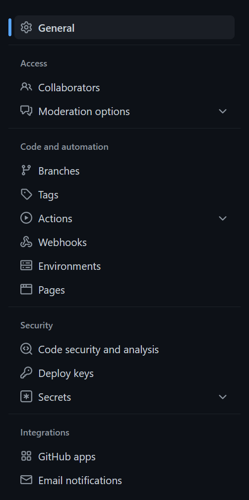
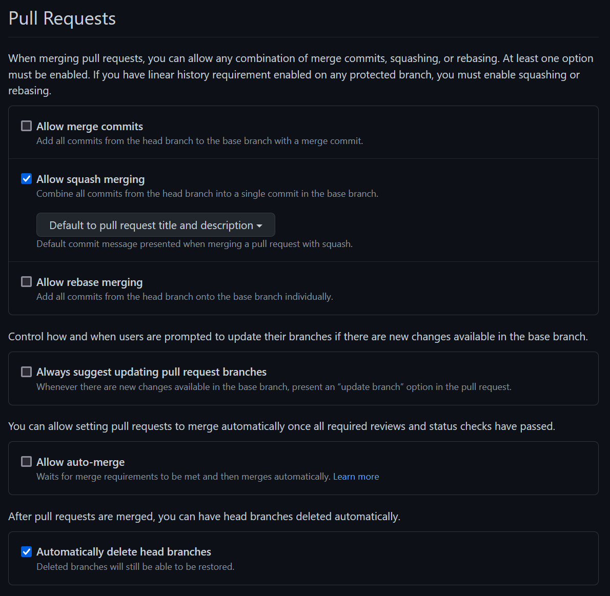
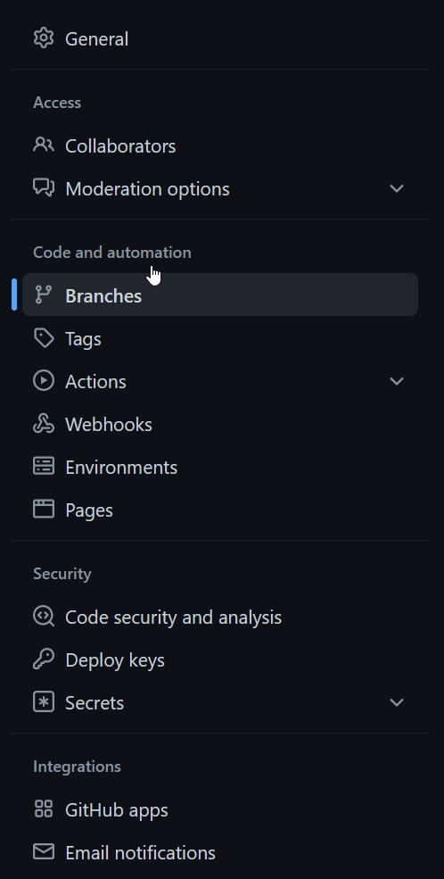
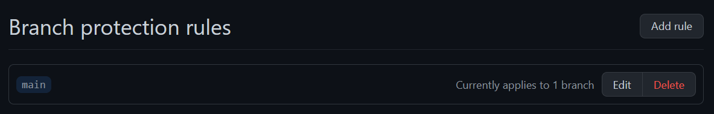
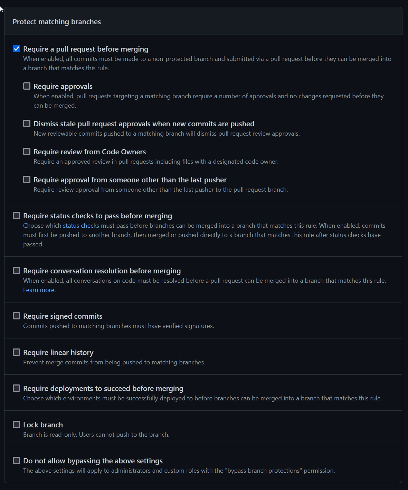

# Getting started

SnipFlow is very easy to get up and running; it's really a set of [CI/CD scripts](./resources.md#cicd-scripts) and [a workflow](./how-it-works.md) to follow day to day. Read on for a step by step guide to setting up a project for SnipFlow, or [jump ahead](#onboarding) if you're joining an existing SnipFlow project.

Although you can use any tooling with SnipFlow, we'll illustrate the steps with examples on this page using:

- Git version control, hosted by [GitHub](https://github.com)
- [GitHub Actions](https://github.com/features/actions) for the CI/CD automation
- [AWS Amplify](https://aws.amazon.com/amplify/) for project hosting
- Task / issue tracking using [GitHub Issues and Projects](https://github.com/features/issues)
- Team collaboration using [Slack](https://slack.com/)

## Setting up

Setting up a project for SnipFlow is fairly simple. You'll want to configure your repository to restrict some actions, your hosting to allow the environment builds, your CI/CD to automate many other actions, and your chat software to connect it all together. [Sample scripts and resources](./resources.md) are available to further simplify it all.

### Repository

Settings

<figure>
    
    <figcaption>GitHub's settings menu with the General section highlighted</figcaption>
</figure>

<figure>
    
    <figcaption>GitHub's Pull Request settings pane</figcaption>
</figure>

<figure>
    
    <figcaption>GitHub's settings menu with the Branches section highlighted</figcaption>
</figure>

<figure>
    
    <figcaption>GitHub's Branch Protection Rules settings pane</figcaption>
</figure>

<figure>
    
    <figcaption>GitHub's individual Branch Protection Rules settings pane</figcaption>
</figure>

templates

### Hosting

setting up

disabling automation

### CI/CD and automation

copying scripts

exposing webhook triggers

### Chat and collaboration software

adding apps to follow events

connecting webhooks

### Process and workflow

terminology

PRs and issues

preview and staging

releasing

## Onboarding

Joining an existing SnipFlow project is really easy. You can read about [all aspects of the process](./how-it-works.md), or get a quick summary below.

### Developers

For developers, you'll need to follow the version control workflow:

- Create a feature branch for each feature, task or issue
- Commit as many times as you like to your feature branch
- Open a PR as early as you like, and certainly before merging your changes

A couple of extra points to keep in mind:

- You should spend time making your [Pull Request](./how-it-works.md#pull-requests) really high quality, ensuring it has all the requirements
- Never rebase anything that's been pushed to the remote repo

### Team Leads, Scrum Masters, Project Managers, Producers

If you're not actually writing code but you're involved in quality, timings, and output at a granular level, SnipFlow makes things easy for you:

- Check in on the [Preview](./how-it-works.md#preview) environment to see the latest state of the project, built and hosted
- Keep on top of the [Pull Request](./how-it-works.md#pr) environments - each PR will usually have a dedicated place that the built code can be browsed; this is your chance to feed in and affect the work before it's merged, and where to keep quality high. - If you're looking at code quality you should of course also be reviewing the PRs carefully
- You can easily deploy to [Staging](./how-it-works.md#staging) or [Production](./how-it-works.md#production) yourself, or ask an engineer without disrupting them too much

Extra things to note:

- It should be easy to follow progress on issues using your collaboration software
- You should never see "it works on my machine" again; every environment is built by the same automated script, never by an individual developer
- You should be able to easily follow the thread from a ticket to the code implementing that feature, to the discussion and amendments made during the PR phase before that code was merged in. You can do this from the task mangement software, or using git blame from the affected lines of code. Debugging should be slightly less painful.
