# How it works

This section is a full rundown of how each element of SnipFlow works and connects together, meant as a reference section. If you'd like to get up and running quickly, you might want to go straight to [Getting started](./getting-started.md).

## Overview

Developers use GitHub Flow, with a squash and merge strategy and a couple of [extra tweaks](#version-control), leading to a [clean commit history](./benefits.md#clean-versioning) and a 1:1 relationship between commits and issues/tickets.

[Environments](#environments) are auto-created to review [Pull Requests](#pull-requests), and for reference of the "latest state" of the project by wider team members, as well as dedicated staging and testing environments.

Deployments are [fully automated](#cicd), and can be run by non-technnical team members at any time - via chatops or a version control web interface. Deployments to each environment are visible to the full team, and code consistency is retained across environments.

## Prerequisites

SnipFlow will work with your existing toolset - but you will need to already understand the basic tools ([version control](#version-control-tool), [CI/CD tooling](#cicd-tools) and [multi-environment hosting](#hosting)) in order to get the best out of it.

### Version control tool

SnipFlow is very similar to [GitHub Flow](https://docs.github.com/en/get-started/quickstart/github-flow), with a few tweaks and emphasis on more than just Git. Version control that includes branching and some sort of [Pull Request](https://docs.github.com/en/pull-requests/collaborating-with-pull-requests/proposing-changes-to-your-work-with-pull-requests/about-pull-requests) system is required for SnipFlow to work fully.

### CI/CD tools

You can use your existing deployment management / automation tooling with SnipFlow, but you will need some sort of system in place (e.g. [GitHub Actions](https://github.com/features/actions) or [CircleCI](https://circleci.com/)), since SnipFlow relies heavily on automation to replace technical administrative tasks.

To work fully with all aspects of SnipFlow, your CI/CD system will need to accept external triggers to manually start deployments. Whichever system you use, we highly recommend something where the configuration is versioned, ideally alongside the project code.

### Hosting

You will of course need project hosting, and the ability to deploy to it via your CI/CD system. More specifically, you will need to be able to run at least 3 distinct environments, and for full SnipFlow benefits you'll need the ability to dynamically provision (and destroy) temporary environments. This is simpler with some hosting setups (and some project types) than others.

## Version control

The core of SnipFlow is a controlled process for using your version control system. Many developers know and use [Git Flow](https://www.atlassian.com/git/tutorials/comparing-workflows/gitflow-workflow); SnipFlow is simpler and very close to [GitHub Flow](https://docs.github.com/en/get-started/quickstart/github-flow), with some tweaks.

The workflow outlined here will be easily recognisable to most developers. We start with our repository's primary branch; we'll be referring to it as the `main` branch.

This is the **only permanent branch** in our repository; every other branch is deleted unless kept for reference purposes.

### Creating new functionality

This is the day-to-day workflow for most of the team. Outlined here is the perspective of a single developer (or XD pair), but in real teamwork this will be happening concurrently between various team members, each running this workflow themselves.

<figure>
    
    <figcaption>The main branch with a single commit</figcaption>
</figure>

An engineer starting on a new feature (or issue), will create a new branch directly from the main branch.

We don't use a `develop` branch since it often ends up being the de facto primary branch in the repository, with the main branch lagging far behind, and needing periodic maintenance in the form of sometimes painful merges.

<figure>
    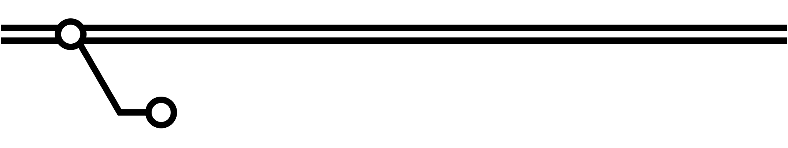
    <figcaption>A new feature branch with a new commit</figcaption>
</figure>

While working on their feature branch, developers are encouraged to commit (and to push) often; don't worry about these commits containing atomic pieces of functionality, or about the message format for them.

Commits made on a feature branch are essentially temporary - they won't make it into the repository's long-term history, and so it's good practice to use commits as a kind of extended "save, backup and share" function.

<figure>
    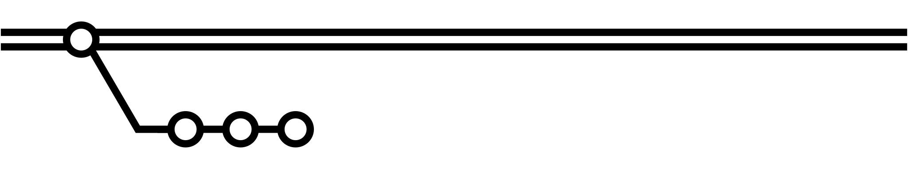
    <figcaption>More commits on the feature branch</figcaption>
</figure>

At some point in development, the coder will be ready to open a [Pull Request](#pull-requests). Since an open PR will result in a new environment[\*](#1), it's common to open PRs early in order to have a central place to discuss functionality with the rest of the team.

This is especially useful if you're working in a cross-disciplinary team where not everybody has easy access to a local environment, but even among devs passing a link is easier than checking out a branch, which may have side effects.

> Note that this isn't native functionality to e.g. git, but is widely supported. You'll be able to make something like this workflow work without it, but you'll miss out on a lot.

<figure>
    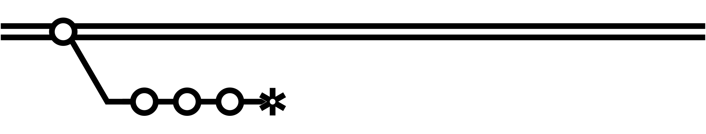
    <figcaption>A Pull Request created from the feature branch</figcaption>
</figure>

Once the PR is open there may well be further commits as the team comments on the code and functionality in the PR.

Each time new code is committed to the PR, the environment is rebuilt, so it stays current.

<figure>
    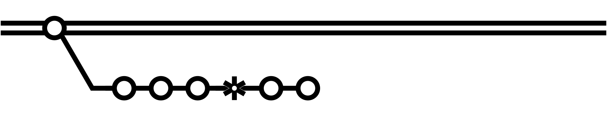
    <figcaption>Further commits on the feature branch after the Pull Request</figcaption>
</figure>

Once the PR is approved and passes all tests, it can be merged back to `main`. We use the **squash and merge** strategy so that all the commits in the feature branch are consolidated into a single commit, related to the PR.

For this reason it's important that each PR has [enough attention](#pull-requests) paid to it before the merge. It will need a clear title and description, should only cover a single unit of functionality and should include any relevant changes to documentation and tests, as well as a link to the relevant issue in the team's task tracker.

All this will mean that the main branch history remains clean and easy to browse in future, and tools such as git blame are helpful for team onboarding and debugging as the project progresses.

If other team members have added features to the main branch during the lifecycle of your own branch, it's possible that you will have to perform some code merges before being able to close the PR. Snipflow recommends we use rebasing to achieve this; it effectively moves all the feature branch changes to be based on top of the latest commit to the main branch (and once we've squashed them this will be the case anyway).

Typically, if feature branches are short-lives (and they should be) the need for manual intervention during the process is very low.

> This is the only time you should need to use rebasing, which can be very dangerous.

<figure>
    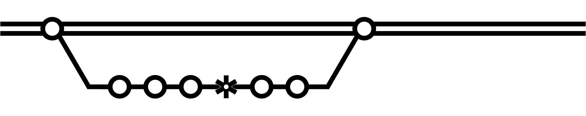
    <figcaption>The feature branch is merged back to main</figcaption>
</figure>

### Releasing

<figure>
    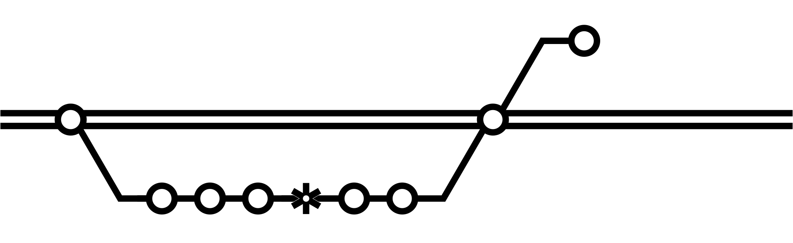
    <figcaption>A new release candidate branch is created</figcaption>
</figure>

<figure>
    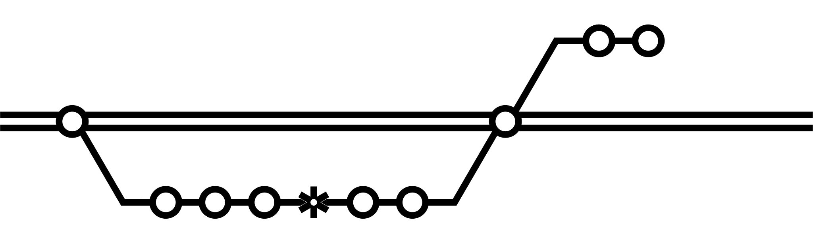
    <figcaption>A hotfix commit is pushed to the release branch</figcaption>
</figure>

<figure>
    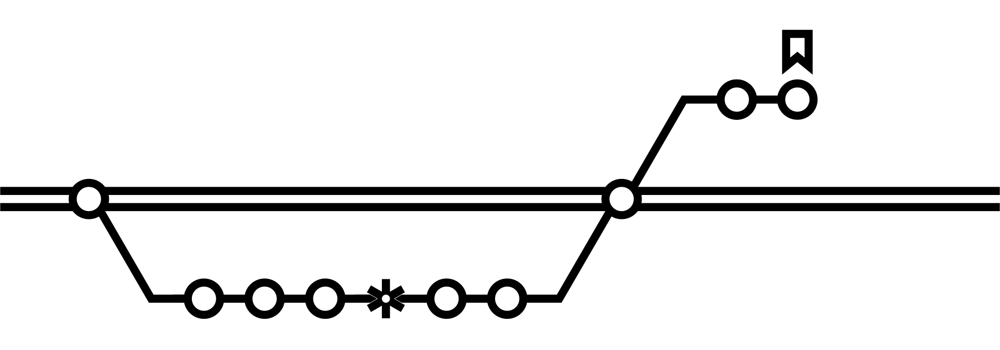
    <figcaption>The latest release branch commit is tagged for deployment to production</figcaption>
</figure>

<figure>
    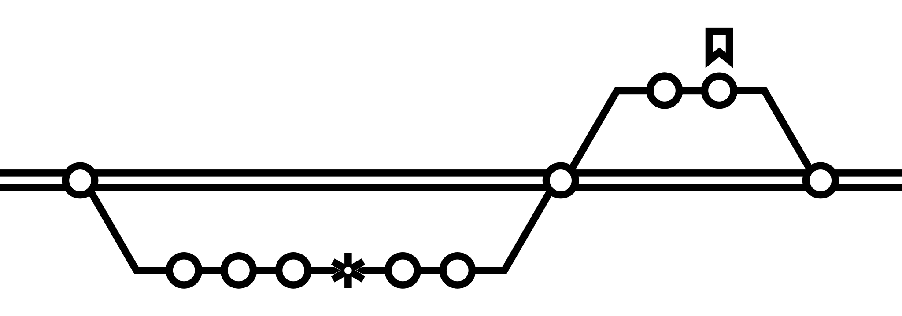
    <figcaption>The release branch is merged back to main</figcaption>
</figure>

### Pull Requests

## Environments

### Production

<figure>
    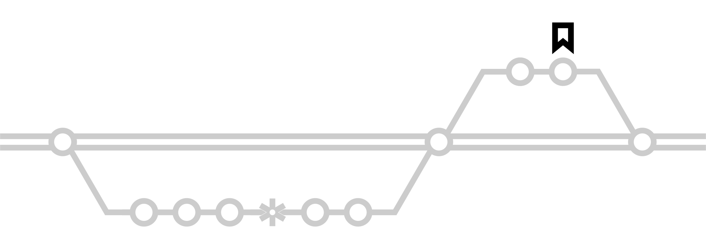
    <figcaption>The production environment is auto-built from the <a href="https://semver.org/" title="Semver: semantic version naming">semver</a>-named tag</figcaption>
</figure>

### Staging

<figure>
    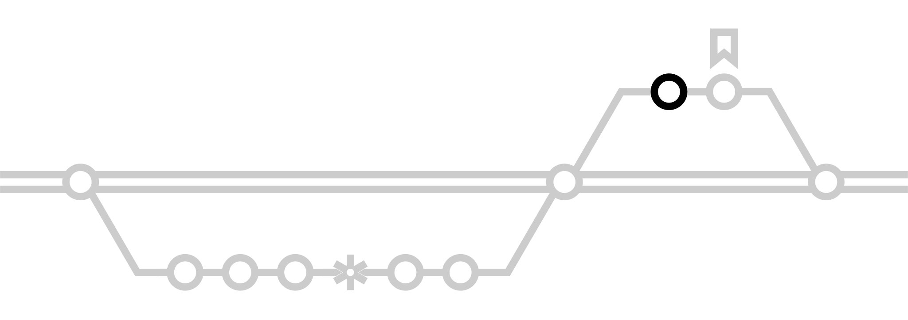
    <figcaption>The test environment is auto-built from the release candidate branch</figcaption>
</figure>

### Test

<figure>
    
    <figcaption>The test environment is auto-built from the release candidate branch</figcaption>
</figure>

### Preview

<figure>
    
    <figcaption>The preview branch is auto-built from the HEAD of the main branch</figcaption>
</figure>

### PR

<figure>
    
    <figcaption>The preview branch is auto-built from the HEAD of the main branch</figcaption>
</figure>

## CI/CD

## ChatOps

Use feature branches off your main repository default branch, merging back via "Squash and Merge", ideally through a Pull Request. If you parallel stream a lengthy QA process before deployment move your candidate to a release branch for this. Deploy by making a semver-named tag in the repo, and follow up by merging your release branch back into the main branch. Supplement these with ChatOps commands where needed.
You'll get environments to review
Each PR
The head of the main branch ("latest progress")
The release candidate
A staging /UAT build
Production
All deployments are automated and can be triggered by any team member (so less developer task switching), and only one branch has important code and any settings, so onboarding is simple. Git history is clean and has a 1:1 relationship with your ticketing tool.

\*{:name='1'} This is easily done with statically-hosted projects, but possible with all projects. In case it's not feasible for you, you can run a version of the workflow without PR ernvironments, or with permanent developer-specific environments, although care must be taken when sharing these.
