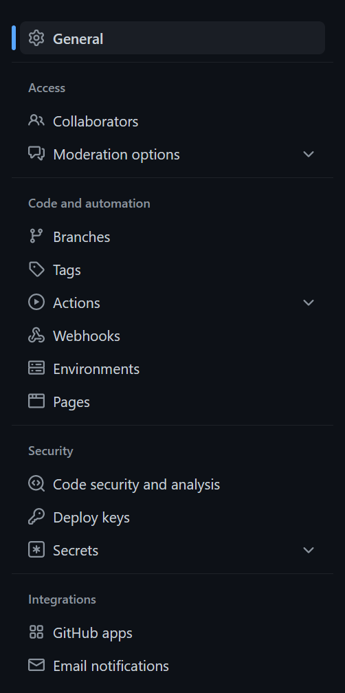
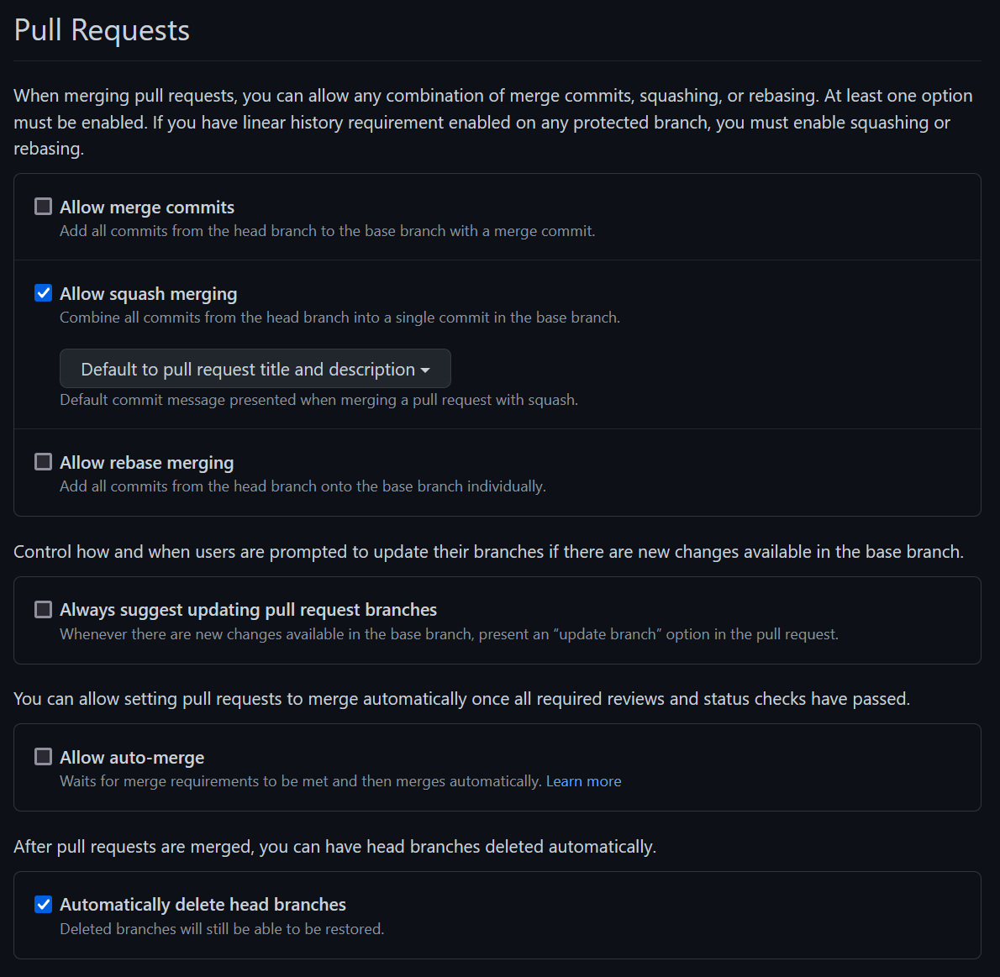
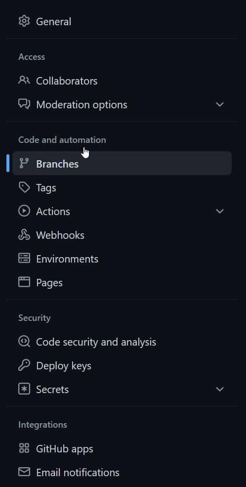
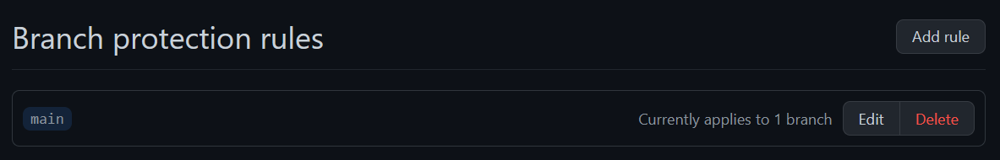
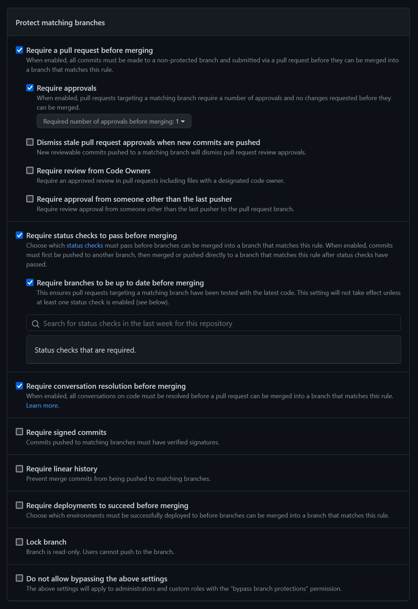

# Getting started

SnipFlow is very easy to get up and running; it's really a set of CI/CD scripts and a workflow to follow day to day. Read on for a step by step guide to setting up a project for SnipFlow, or go straight to [onboarding](./onboarding.md) if you're joining an existing SnipFlow project.

Although you can use any tooling with SnipFlow, we'll illustrate the steps with examples on this page using:

- Git version control, hosted by [GitHub](https://github.com)
- [GitHub Actions](https://github.com/features/actions) for the CI/CD automation

[Sample scripts and resources](./resources.md) are available to further simplify it all.

## Repository

The main repository configuration is to enforce the squash and merge PR strategy. Start by visiting the Settings page of your repository, under the "General" tab.

<figure>
    
    <figcaption>GitHub's settings menu with the General section highlighted</figcaption>
</figure>

Scroll to the "Pull Requests" section, and ensure "Allow squash merging" is the only selected option of the (usually) 3 available. Github has a sub-option in this section to default the resulting commit message to the PR title and description, which is ideal for SnipFlow.

For repo cleanliness, you may also want to automatically delete head branches - this means that after a PR is merged the relevant branch is deleted, making it easier for people to find relevant branches when needed.

<figure>
    
    <figcaption>GitHub's Pull Request settings pane</figcaption>
</figure>

Next, we need to ensure that PRs are enforced for any updates to the `main` branch. Go to the "Branches" section of the settings navigation.

<figure>
    
    <figcaption>GitHub's settings menu with the Branches section highlighted</figcaption>
</figure>

You then need to set up a protection rule set for the `main` branch, and hit the "Edit" button.

<figure>
    
    <figcaption>GitHub's Branch Protection Rules settings pane</figcaption>
</figure>

Within that branch protection rules pane, the only full requirement is to enable "Require a pull request before merging".

It's a good idea to also select "Require approvals", "Require status checks to pass before merging" and "Require conversation resolution before merging". Many teams also want further restrictions in place.

<figure>
    
    <figcaption>GitHub's individual Branch Protection Rules settings pane</figcaption>
</figure>

After updating all the settings, you may want to add [templates](./resources.md#samples-and-resources) to your repository, to help ensure that standards are met when e.g. opening Pull Requests.

## Hosting

How your hosting is configured is really up to you and the requirements of your project. In order to ensure SnipFlow works, you just have to ensure that

- You can easily have multiple environments for your project (ideally with some that can be auto-created and -destroyed)
- You have no "auto-deployment" features from your hosting setup enabled; we will control all all our builds via our own CI/CD scripts, set up in the next section
- You are able to push built code to your hosting environment using automations, perhaps using an API

In Vercel, we will configure our project to use the [Vercel API](https://vercel.com/docs/rest-api#endpoints/deployments/create-a-new-deployment) for deployments rather than any of the other options; likewise in AWS Amplify we'll make sure we don't "connect" our repository.

## CI/CD and automation

The heart of SnipFlow is the automation scripts. You can browse our [sample scripts and resources](./resources.md) or write your own, but once you have scripts that suit your tooling setup you can usually simply copy them into the right place.

When using GitHub Actions, automation scripts are written as YAML files and saved in the repo under the `./github/workflows` folder. We want scripts that trigger environment builds on the following triggers:

- manual trigger (for Staging and occasional other environments for flexibility)
- Release - or git tag creation (for Production environment)
- `main` branch updated (for Preview environment)
- Pull Request created, updated (for PR environments)

If you're using GitHub you can also send all deployment events via the GitHub Deployment API, which captures the deployment environment, URL and commit hash, and uses that information to keep the GitHub UI updated (e.g. with [view deployment](https://github.com/marcelkornblum/snipflow/pull/16) buttons on the Pull Requests, and a page listing all environments, and which code was deployed where, and when).

In order to run your manual trigger, you'll either need an automation tool that allows that, or you'll need to expose a webhook or similar endpoint to trigger the right action. This will allow your ChatOps integration, but it's also possible you may need an extra service to enable this. One such service is [Deploybot](./resources.md#deploybot).

## Chat and collaboration software

If you're using a chat based collaboration platform like Slack, you will want to create a project channel with an integration to Github or your repo host of choice, to follow along with all the repo events. If you're using GitHub Deployments, these will also be posted to the Slack channel, giving your whole team greater insight into what's going on.

If you have a way to trigger your manual automations from an endpoint, you should then connect that endpoint to an integration in your collaborative chat client; this allows any team member to trigger a build from Slack or the equivalent, making it quick and easy for even non-technical people to runb builds.

It's possible you may need an extra service to enable the connection between chat and automation. One such service is [Deploybot](./resources.md#deploybot).

## Process and workflow

The last step is non-technical; your team needs to understand and adopt the workflow, and specifically the following aspects:

- **Terminology**; it's important that everyone refers to e.g. each environment the same way each time, to reduce confusion
- **PRs and issues**; the clean version history only really makes sense if [PRs are well written](./how-it-works.md#pull-requests) and contain links to issues, designs and other documentation that is pertinent
- **Preview and Staging environments**; because the [Preview environment](./how-it-works.md#preview) auto-builds each time a PR is merged, it's perfect for internal team members to keep abreast of developments, but less than ideal for senior stakeholders or clients to review the work so far (that's what [Staging](./how-it-works.md#staging) is for).
- **Releasing**; it's [a straightforward process](./how-it-works.md#releasing) but one your team need to understand
