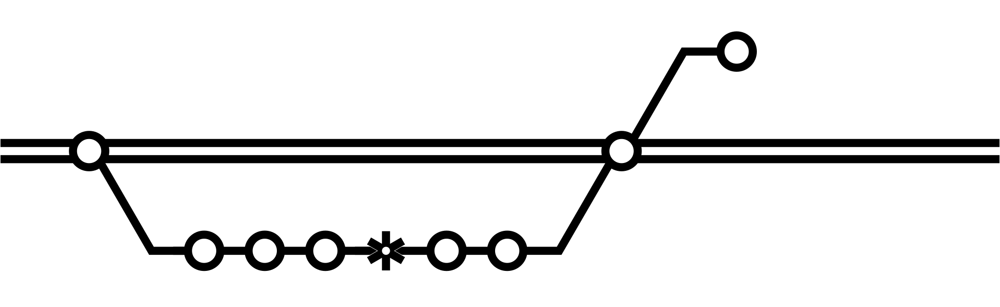
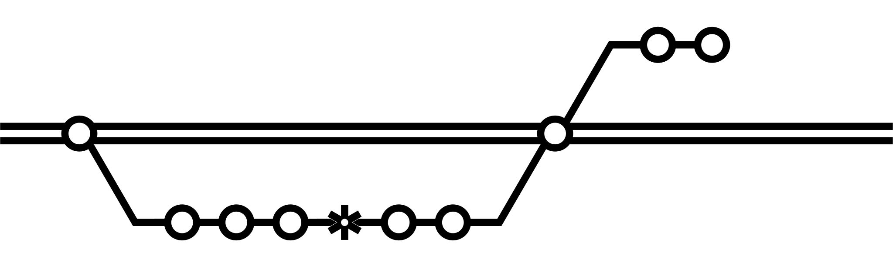
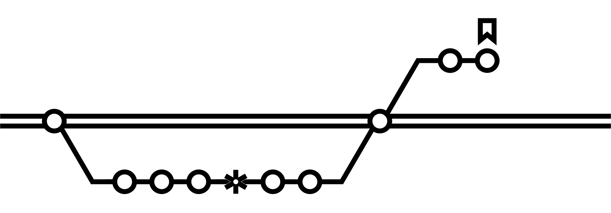
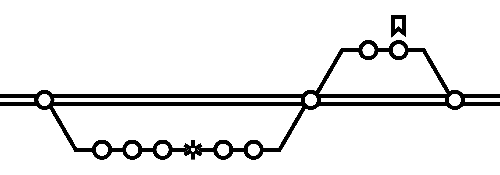
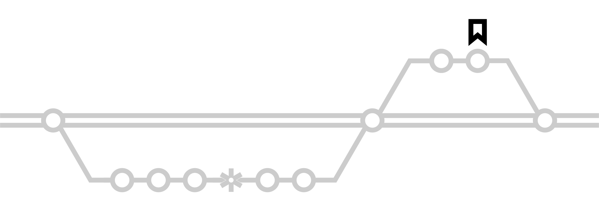

# How it works

This section is a full rundown of how each element of SnipFlow works and connects together, meant as a reference section. If you'd like to get up and running quickly, you might want to go straight to [Getting started](./getting-started.md) or use the site navigation to jump to a specific section.

## Overview

Developers use GitHub Flow, with a squash and merge strategy and a couple of [extra tweaks](#version-control), leading to a [clean commit history](./benefits.md#clean-versioning) and a 1:1 relationship between commits and issues/tickets.

[Environments](#environments) are auto-created to review [Pull Requests](#pull-requests), and for reference of the "latest state" of the project by wider team members, as well as dedicated staging and testing environments.

Deployments are [fully automated](#cicd), and can be run by non-technnical team members at any time - via chatops or a version control web interface. Deployments to each environment are visible to the full team, and code consistency is retained across environments.

## Prerequisites

SnipFlow will work with your existing toolset - but you will need to already understand the basic tools ([version control](#version-control-tool), [CI/CD tooling](#cicd-tools) and [multi-environment hosting](#hosting)) in order to get the best out of it.

### Version control tool

SnipFlow is very similar to [GitHub Flow](https://docs.github.com/en/get-started/quickstart/github-flow), with a few tweaks and emphasis on more than just Git. Version control that includes branching and some sort of [Pull Request](https://docs.github.com/en/pull-requests/collaborating-with-pull-requests/proposing-changes-to-your-work-with-pull-requests/about-pull-requests) system is required for SnipFlow to work fully.

### CI/CD tools

You can use your existing deployment management / automation tooling with SnipFlow, but you will need some sort of system in place (e.g. [GitHub Actions](https://github.com/features/actions) or [CircleCI](https://circleci.com/)), since SnipFlow relies heavily on automation to replace technical administrative tasks.

To work fully with all aspects of SnipFlow, your CI/CD system will need to accept external triggers to manually start deployments. Whichever system you use, we highly recommend something where the configuration is versioned, ideally alongside the project code.

### Hosting

You will of course need project hosting, and the ability to deploy to it via your CI/CD system. More specifically, you will need to be able to run at least 3 distinct environments, and for full SnipFlow benefits you'll need the ability to dynamically provision (and destroy) temporary environments. This is simpler with some hosting setups (and some project types) than others.

## Version control

The core of SnipFlow is a controlled process for using your version control system. Many developers know and use [Git Flow](https://www.atlassian.com/git/tutorials/comparing-workflows/gitflow-workflow); SnipFlow is simpler and very close to [GitHub Flow](https://docs.github.com/en/get-started/quickstart/github-flow), with some tweaks.

The workflow outlined here will be easily recognisable to most developers. We start with our repository's primary branch; we'll be referring to it as the `main` branch.

This is the **only permanent branch** in our repository; every other branch is deleted unless kept for reference purposes.

### Writing features

This is the day-to-day workflow for most of the team. Outlined here is the perspective of a single developer (or XD pair), but in real teamwork this will be happening concurrently between various team members, each running this workflow themselves.

<figure>
    
    <figcaption>The main branch with a single commit</figcaption>
</figure>

An engineer starting on a new feature (or issue), will create a new branch directly from the main branch. We don't need to be very strict with branch naming as long as it doesn't affect the automation in place; it's common to name the branch `feature/xxx` where `xxx` refers to the ticket number being addressed, but as long as it doesn't start with the protected word `release` SnipFlow doesn't really mind what the name it.

We don't use a `develop` branch since it often ends up being the de facto primary branch in the repository, with the main branch lagging far behind, and needing periodic maintenance in the form of sometimes painful merges.

<figure>
    
    <figcaption>A new feature branch with a new commit</figcaption>
</figure>

While working on their feature branch, developers are encouraged to commit (and to push) often; don't worry about these commits containing atomic pieces of functionality, or about the message format for them.

Commits made on a feature branch are essentially temporary - they won't make it into the repository's long-term history, and so it's good practice to use commits as a kind of extended "save, backup and share" function.

<figure>
    
    <figcaption>More commits on the feature branch</figcaption>
</figure>

At some point in development, the coder will be ready to open a [Pull Request](#pull-requests). Since an open PR will result in a new [**PR** environment](#pr) [&spades;](#1){:name='1-source'}, it's common to open PRs early in order to have a central place to discuss functionality with the rest of the team.

This is especially useful if you're working in a cross-disciplinary team where not everybody has easy access to a local environment, but even among devs passing a link is easier than checking out a branch, which may have side effects.

> Note that this isn't native functionality to e.g. git, but is widely supported. You'll be able to make something like this workflow work without it, but you'll miss out on a lot.

<figure>
    
    <figcaption>A Pull Request created from the feature branch</figcaption>
</figure>

Once the PR is open there may well be further commits as the team comments on the code and functionality in the PR.

Each time new code is committed to the PR, the environment is rebuilt, so it stays current.

<figure>
    
    <figcaption>Further commits on the feature branch after the Pull Request</figcaption>
</figure>

Once the PR is approved and passes all tests, it can be merged back to `main`. We use the **squash and merge** strategy so that all the commits in the feature branch are consolidated into a single commit, related to the PR.

For this reason it's important that each PR has [enough attention](#pull-requests) paid to it before the merge. It will need a clear title and description, should only cover a single unit of functionality and should include any relevant changes to documentation and tests, as well as a link to the relevant issue in the team's task tracker.

All this will mean that the main branch history remains clean and easy to browse in future, and tools such as git blame are helpful for team onboarding and debugging as the project progresses.

If other team members have added features to the main branch during the lifecycle of your own branch, it's possible that you will have to perform some code merges before being able to close the PR. Snipflow recommends we use rebasing to achieve this; it effectively moves all the feature branch changes to be based on top of the latest commit to the main branch (and once we've squashed them this will be the case anyway).

> This is the only time you should need to use rebasing, which can be very dangerous.

Typically, if feature branches are short-lived (and they should be) the need for manual intervention during the process is very low.

<figure>
    
    <figcaption>The feature branch is merged back to main</figcaption>
</figure>

At this point the PR environment should be destroyed, the feature branch deleted, and the [**preview** environment](#preview) will update to reflect the main branch.

### Releasing

It's possible to release very simply from the main branch without most of this process if, for example, you have a small team and quick releases.

Many teams will need a more robust process in order to handle e.g. dedicated testing environment
and resources that run concurrently to other features being developed. In order therefore to run
a release prcoess that doesn't interfere with team members that may be working against the main
branch (and for work that isn't scheduled to be released), the first step is to create a new
release candidate branch.

This should typically be named `release/xxx` where `xxx` is the next release number. This naming scheme ensures the banch is not easily confused with a feature branch.

Creating a branch according to this naming pattern will auto-deploy the [**test** environment](#test).

<figure>
    
    <figcaption>A new release candidate branch is created</figcaption>
</figure>

During QA it's common to spot easily-fixed issues that shouldn't derail the entire release process. Simply make hotfix commits directly to the release candidate branch, which will auto-update the test environment.

<figure>
    
    <figcaption>A hotfix commit is pushed to the release branch</figcaption>
</figure>

It's usualy to also build a [**staging** environment](#staging) from this branch, unless you're running a simplified release process directly from `main`.

When QA, UAT and any other processes are all completed and passing, it's time to deploy to the [**production** environment](#production).

<figure>
    
    <figcaption>The latest release branch commit is tagged for deployment to production</figcaption>
</figure>

This is done by making a tag in the repository, targetting the HEAD of the release candidate branch. The tag should be named with the semver formatted version number of the next release.

> All releases in a SnipFlow repo have a semver-named tag in the repo, so it's easy to go back to the code that's been in production at any given time, in sequence.

<figure>
    
    <figcaption>The release branch is merged back to main</figcaption>
</figure>

After completing the release process, squash-and-merge the release candidate branch back into main (to capture any hotfix commits) and delete the branch.

## Pull Requests

Pull Requests are a very important aspect of SnipFlow. While in SnipFlow we don't put any emphasis on individual commits being important (i.e. it doesn't matter what the commit title is, or that it contains either a single or a whole unit of functionality), we **do** put emphasis on all of those things -- and more -- at the PR stage.

Because we use the _squash-and-merge_ strategy for the actual merging in of the PR, the title will become the title of the (single) commit that ends up on the `main` branch, representing all the work that went into this feature -- which we _do_ want to keep "clean".

Git hosts that support PRs generally also generally link the merge commit back to the closed PR page in their UIs. The combination of this and a clean main branch history mean it's easy to use tools like Git Blame but also the repo UI to understand the decisionmaking around a feature.

In order to make the most of that, it's important that a PR:

- Have a concise, descriptive title
- Have a description containing:
  - A link to the relevant issue or task
  - A short description of the changes in the PR from a technical point of view
  - An outline of the impact of those changes on the codebase and to other developers on the team
- Contain all tests and test changes relevant to the functionality in the PR
- Contain all documentation and updates to docs relevant to the code in the PR

Because we will be using CI/CD to push the changes introduced by the PR to the preview environment, and then into releases etc, the PR is the perfect place to ensure code quality. To that end, a PR should ideally also:

- Automatically run all automated tests, especially unit tests
- Automatically run any other tooling such as linters, security analysis tools, etc.
- Not be merge-able without all tests passing
- Not be merge-able without approval from other team members (ideally specific leads and/or principals in the area of code affected)

Please visit the [resources](./resources.md) page for example Pull Request templates you can use to remind the team what should go into a PR.

## Environments

For ongoing projects, SnipFlow encourages 4 permanent environments as well as a temporary environment for each open Pull Request. Many smaller teams don't need the [**test** environment](#test) - if that sounds like you feel free to skip it; it's easy to add to the workflow as and when you need it.

For projects with complex hosting requirements, [**pr** environments](#pr) may not be feasible; the best option is [**developer** environments](#per-developer) (which aren't otherwise necessary).

### Production

This is the main environment where your project 'lives'. We auto-build it from a tag in the repo (i.e. pointing to s apecific commit) so that it's always easy to find the exact code that went live at any specific time.

The tag should be named according to the [semver](https://semver.org/) versioning system, not least so that the automation can easily use that information.

If you're using a tool that supports it (such as GitHub), it's best to make this tag from the Releases part of the UI, since that allows you to add documentation about the release that's also useful in future.

<figure>
    
    <figcaption>The production environment is auto-built from the <a href="https://semver.org/" title="Semver: semantic version naming">semver</a>-named tag</figcaption>
</figure>

### Staging

This is the environment used for UAT and for communicating with stakeholders before deployments. In smaller projects you may also want to use it for manual QA.

Since it will be visible to many people and is the focus of a lot of communication, we trigger builds to this environment manually - ideally via [ChatOps](#chatops). Typically, we will want to buildit from the HEAD of the latest release candidate branch, but in smaller teams that don't run the full release process, it is also often built from the main branch.

<figure>
    
    <figcaption>The staging environment is manually built, either from the release branch or sometimes from main</figcaption>
</figure>

### Test

A dedicated environment for QA and related purposes is useful to many teams. This environment is auto-built and updated from the HEAD of the latest release candidate branch.

<figure>
    
    <figcaption>The test environment is auto-built from the release candidate branch</figcaption>
</figure>

### Preview

This environment is for use by internal team members (as opposed to wider project stakeholders) such as Scrum Masters, PMs, designers, etc.

Often overlooked in other workflow systems, this is a critical piece of SnipFlow's appeal and makes project communication much easier while brining transparency to the process.

Since it auto-builds from the head of the main branch, it represents the current "latest state" of the project - all automated tests etc should have taken place and so it's unlikely that things will be completely broken on this environment, but it's also not uncommon to fin dissues here that would need rectifying before showing the project to wider stakeholder groups.

<figure>
    
    <figcaption>The preview environment is auto-built from the HEAD of the main branch</figcaption>
</figure>

### PR

Auto-built from the HEAD of any branch with an open Pull Request, having this environment makes it much easier to review the code and the results of the code before it is merged into the main branch.

For projects with complex hosting it may not be possible to use these environments, in which case it's worth consideringthe next [**per-developer** environment approach], but these should be used where possible.

Ideally the link to the environment will be auto-posted to the Pull Request so it can be found easily.

The environment should be destroyed when the PR is closed.

<figure>
    
    <figcaption>The PR environment is auto-built from the HEAD of a feature branch containing an open PR</figcaption>
</figure>

### Per-developer

Not part of the recommended approach, these environments are nevertheless useful when it's not feasible to have many temporary PR environments in operation at once (for example when dealing with a complex or data-heavy back end).

Simply put, this environment should be manually triggered (ideally via [ChatOps](#chatops)) and each developer should have an environment they can control. They should be able to target any given ccommit or the HEAD of any branch, and will typically use it on whichever feature branch they are currently most active on.

<figure>
    
    <figcaption>The developer environment is manually built from any given commit, typically from a feature branch</figcaption>
</figure>

## CI/CD

All deployments are automated, meaning no developer should ever be running builds on their machine that are then pushed to an environment. This reduces technical administration (which can be disruptive) and risk, since it's very easy -- particularly under high stress -- to make mistakes, perhaps involving the wrong environment variables or being in the wrong branch.

The majority of the builds will be automatically triggered, with only production and staging environments typically requiring manual triggering. These manual triggers can be activated by anyone on the team (in practice, this means anyone with write access to the repository, or added to e.g. the relevant Slack channel). This gives trust and ownership to team members and increases agility since people don't have to wait for outside agencies to run deployments.

All builds to any environment should be inspectable by any team member, and in the best case each team member can see which code was built to which environment at what time - this is simple e.g. when using GitHub along with their _deployments_ API. This increases transparency and makes it easier to rationalise about (and debug) running code.

For example scripts you can drop into your project, refer to the [resources](./resources.md) section.

## ChatOps

For the few manually triggered events in SnipFlow (e.g. deployments to staging environments, or occasional overrides to the process) we've found a ChapOps approach to be very useful.

In a perfect world there would be a chat channel dedicated to the technical aspects of a project and with all hands-on team members added; this may already contain e.g. notifications from the version control system about repository events, etc.

By connecting this channel to the repo'd manual events it's possible to trigger deployments very easily and transparently. An example implementation of a way to do this can be found in the [deploybot](./resources.md#deploybot) section.

<a href="#1-source" name="1">&spades;</a> This is easily done with statically-hosted projects, but possible with all projects. In case it's not feasible for you, you can run a version of the workflow without PR ernvironments, or with permanent developer-specific environments, although care must be taken when sharing these.

